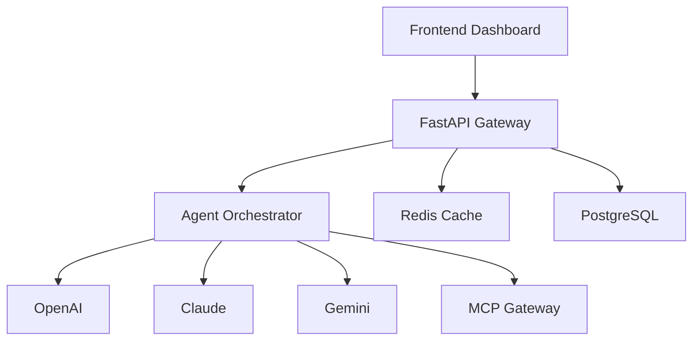

# Tech Stack & Architecture

## 🛠️ Backend

| Technology | Purpose | Version |
|------------|---------|---------|
| [FastAPI](https://fastapi.tiangolo.com/) | API Framework | 0.109+ |
| [Pydantic](https://pydantic.dev/) | Data Validation | 2.5+ |
| [Redis](https://redis.io/) | Real-time State | Latest |
| [PostgreSQL](https://postgresql.org/) | Persistence | 16+ |
| [httpx](https://www.python-httpx.org/) | HTTP Client | 0.26+ |

## 🤖 AI Providers

| Provider | Models | Cost Optimization |
|---------|--------|-------------------|
| OpenAI | GPT-4o, GPT-4 Turbo | ✓ |
| Anthropic | Claude 3.5 Sonnet, Opus | ✓ |
| Google | Gemini 1.5 Pro/Flash | ✓ (Cheapest) |
| Azure OpenAI | Enterprise GPTs | ✓ |

## 🎨 Frontend (Planned)

| Technology | Purpose |
|------------|---------|
| React 19 | Dashboard |
| Tailwind CSS | Styling |
| TanStack Query | Data Fetching |
| WebSocket | Real-time |

## 🔌 Protocols & Standards

- **MCP** (Model Context Protocol) - Enterprise agent communication
- **OpenAPI/Swagger** - Interactive API docs
- **OAuth 2.0** - Secure API key management

## 🐳 Deployment

```dockerfile
# Dockerfile (coming soon)
FROM python:3.12-slim
COPY ./backend /app
WORKDIR /app
RUN pip install -r requirements.txt
CMD ["uvicorn", "app.main:app", "--host", "0.0.0.0", "--port", "8000"]
```

## 📊 Architecture Diagram



## 🚀 Development Setup

```bash
# Backend
pip install -r backend/requirements.txt
cd backend && python main.py

# Frontend (coming soon)
cd frontend && npm install && npm run dev
```

---

**Built with ❤️ by [Ossama Hashim](https://github.com/SamoTech)**