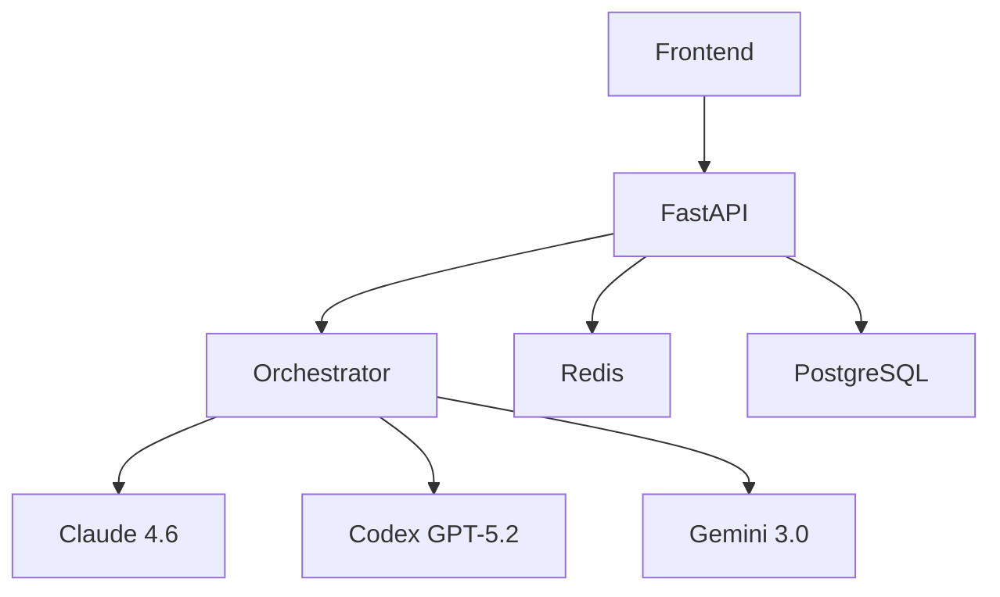

# Tech Stack & Architecture

## 🛠️ Backend

| Technology | Purpose | Version |
|------------|---------|---------|
| [FastAPI](https://fastapi.tiangolo.com/) | API Framework | 0.109+ |
| [Pydantic](https://pydantic.dev/) | Data Validation | 2.5+ |
| [Redis](https://redis.io/) | Real-time State | Latest |
| [PostgreSQL](https://postgresql.org/) | Persistence | 16+ |
| [httpx](https://www.python-httpx.org/) | HTTP Client | 0.26+ |

## 🤖 AI Providers (Feb 2026)

| Provider | Latest Agent/Model | Strengths | Cost (per 1M tokens) |
|----------|-------------------|-----------|----------------------|
| Anthropic | **Claude 4.6 Sonnet** | #1 coding autonomy | Input: $3 / Output: $15 |
| OpenAI | **Codex GPT-5.2** | GitHub Copilot | Input: $5 / Output: $15 |
| Google | **Gemini 3.0 Pro** | Cheapest frontier | Input: $0.35 / Output: $1.05 |

## 🎨 Frontend (Planned)

| Technology | Purpose |
|------------|---------|
| React 19 | Dashboard |
| Tailwind CSS | Styling |
| TanStack Query | Data Fetching |

## 🔌 Protocols
- **MCP** - Model Context Protocol
- **OpenAPI** - Interactive docs
- **OAuth 2.0** - API keys

## 🐳 Deployment
```dockerfile
FROM python:3.12-slim
COPY ./backend /app
WORKDIR /app
RUN pip install -r requirements.txt
CMD ["uvicorn", "app.main:app", "--host", "0.0.0.0", "--port", "8000"]
```

## 📊 Architecture


**Latest models auto-configured** via `backend/app/core/models.py`